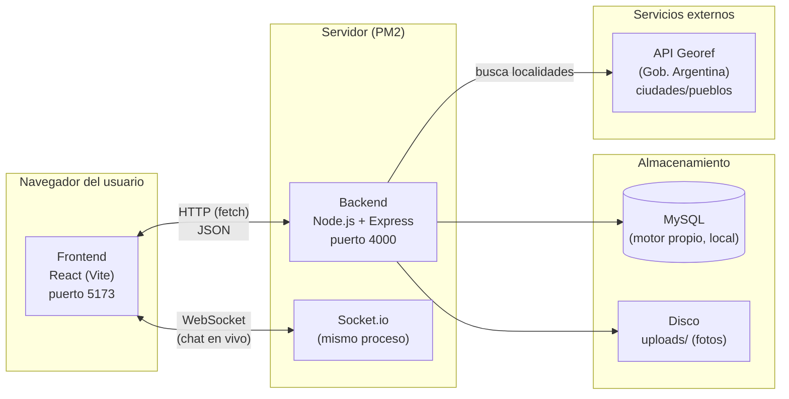
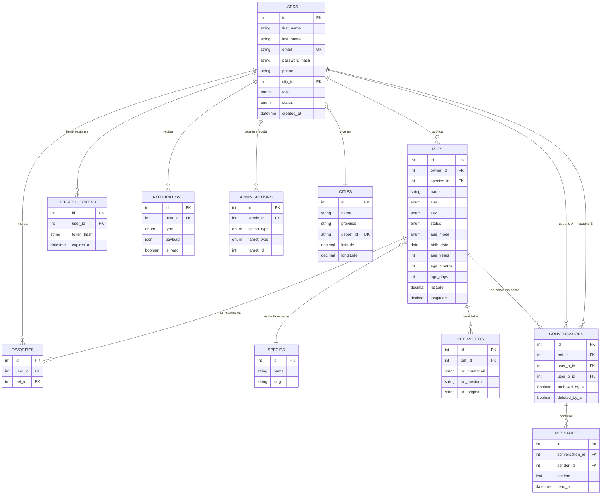
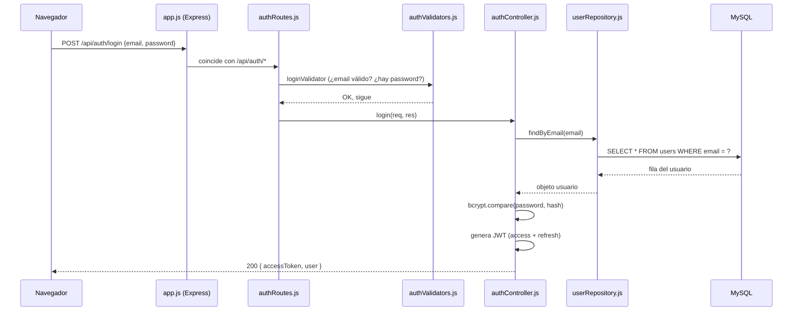
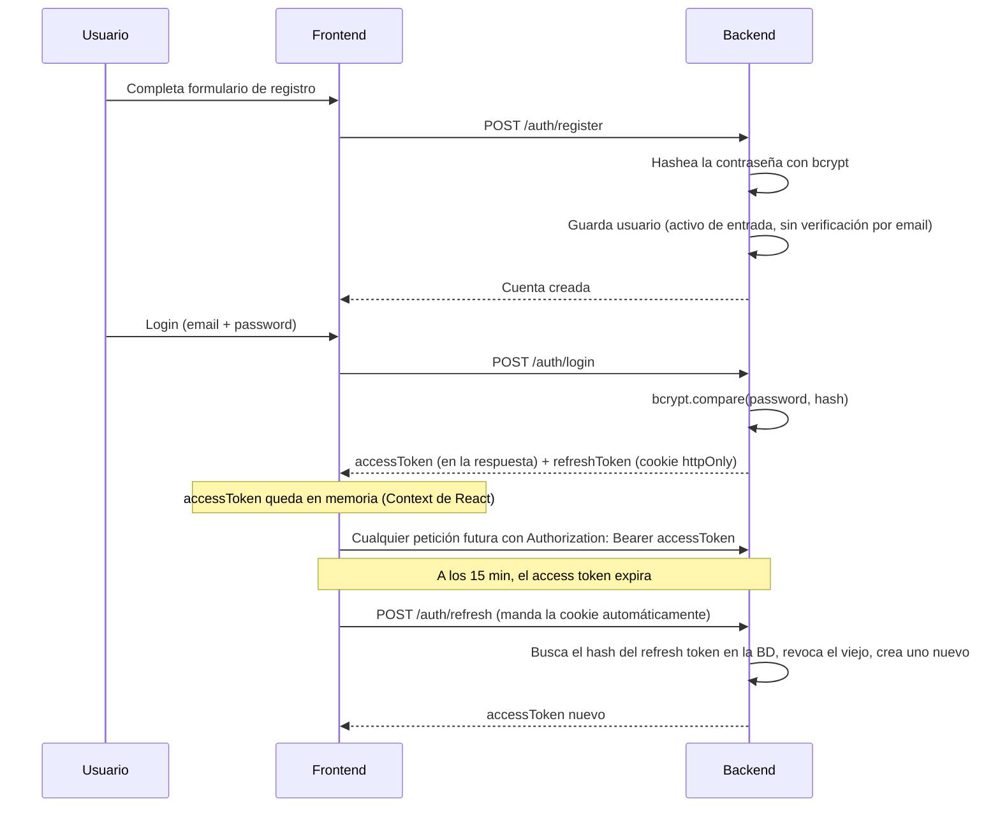
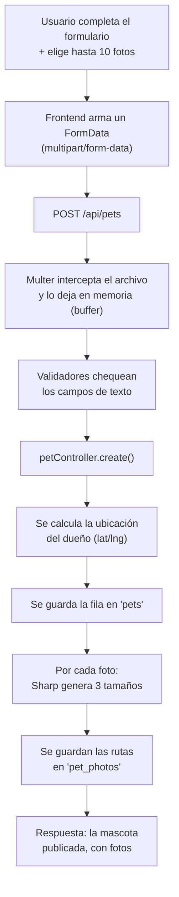
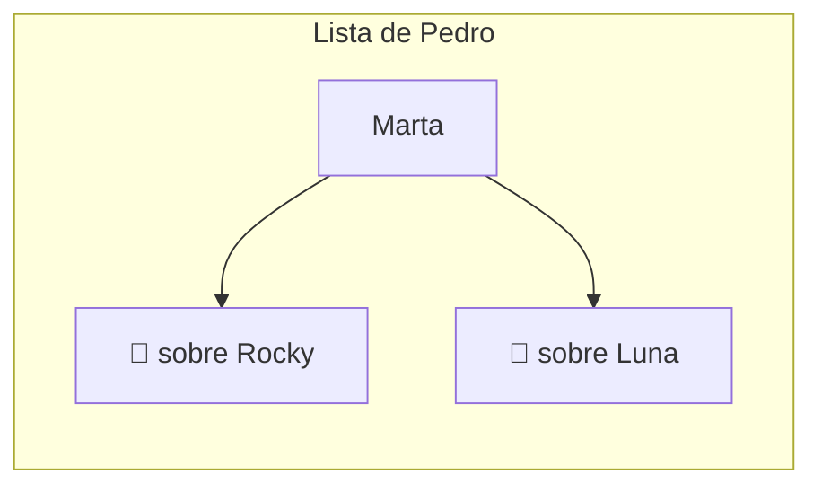
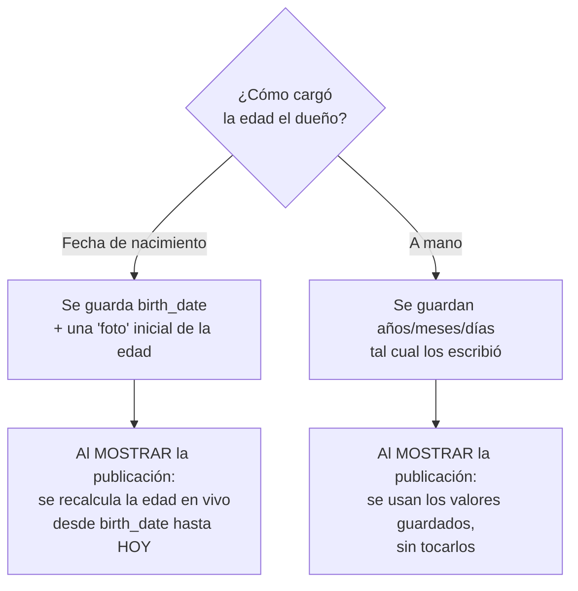
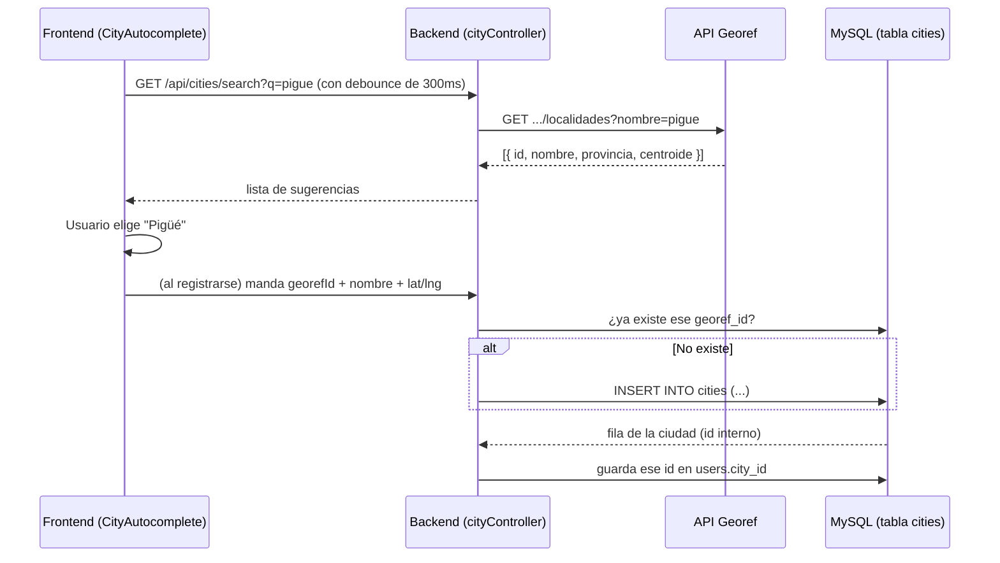
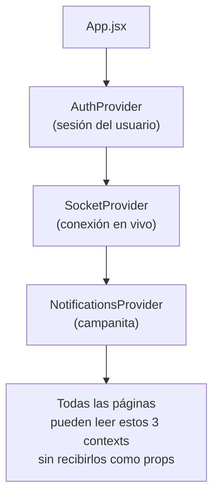

# PataHogar — Documentación técnica completa

> Este documento explica **todo** el proyecto: qué tecnología se usó en cada parte, por qué se eligió esa y no otra, cómo está organizado el código, y cómo funciona cada pieza importante paso a paso. La idea es que puedas explicarlo en la escuela como si lo hubieras escrito vos mismo, y que si mañana querés cambiar algo a mano, sepas exactamente en qué archivo tocar.

**Cómo usar esto:** no hace falta leerlo de corrido. Andá a la sección que te interese. Cada sección tiene: **qué es**, **por qué se usa acá**, **cómo funciona** (con código real del proyecto) y, cuando ayuda, un diagrama.

---

## Índice

1. [Qué es PataHogar](#1-qué-es-patahogar)
2. [Arquitectura general (el panorama completo)](#2-arquitectura-general-el-panorama-completo)
3. [El stack tecnológico, pieza por pieza](#3-el-stack-tecnológico-pieza-por-pieza)
4. [Cómo está organizado el código (mapa de carpetas)](#4-cómo-está-organizado-el-código-mapa-de-carpetas)
5. [La base de datos a fondo](#5-la-base-de-datos-a-fondo)
6. [El patrón de capas del backend](#6-el-patrón-de-capas-del-backend)
7. [Autenticación: cómo sabe el sistema quién sos](#7-autenticación-cómo-sabe-el-sistema-quién-sos)
8. [Publicar una mascota y el procesamiento de imágenes](#8-publicar-una-mascota-y-el-procesamiento-de-imágenes)
9. [Búsqueda, filtros y la fórmula de Haversine](#9-búsqueda-filtros-y-la-fórmula-de-haversine)
10. [Chat en tiempo real con Socket.io](#10-chat-en-tiempo-real-con-socketio)
11. [Notificaciones](#11-notificaciones)
12. [El sistema de edad de las mascotas](#12-el-sistema-de-edad-de-las-mascotas)
13. [Autocompletado de ciudades (API Georef)](#13-autocompletado-de-ciudades-api-georef)
14. [El frontend por dentro: React, Context y componentes](#14-el-frontend-por-dentro-react-context-y-componentes)
15. [El cliente HTTP y el refresco automático de sesión](#15-el-cliente-http-y-el-refresco-automático-de-sesión)
16. [Seguridad: qué se hizo y por qué](#16-seguridad-qué-se-hizo-y-por-qué)
17. [Cómo correr todo (resumen)](#17-cómo-correr-todo-resumen)
18. [Glosario de términos técnicos](#18-glosario-de-términos-técnicos)

---

## 1. Qué es PataHogar

Una plataforma web de adopción de mascotas, tipo "Facebook Marketplace pero solo para adoptar animales". Un usuario se registra, puede publicar una mascota en adopción con fotos, otro usuario la busca/filtra, la contacta por un chat interno en tiempo real, y el dueño puede ir cambiando el estado de la publicación hasta marcarla como adoptada.

Es una aplicación **full-stack**: hay una parte que corre en el navegador del usuario (**frontend**) y una parte que corre en un servidor (**backend**), que se hablan entre sí a través de internet (o de la red local, en desarrollo) usando el protocolo HTTP y, para el chat, WebSockets.

---

## 2. Arquitectura general (el panorama completo)



**La idea clave:** el frontend (lo que ves y tocás) **nunca** habla directo con la base de datos. Todo pasa por el backend, que es el único que tiene el usuario/contraseña de MySQL y decide qué se puede hacer y qué no. Esto es una regla de seguridad básica: **el cliente nunca es de confianza**, porque cualquiera puede abrir las herramientas de desarrollador del navegador y mandar peticiones falsas. Por eso todo se vuelve a validar en el servidor, aunque el frontend ya haya validado "para la experiencia del usuario".

---

## 3. El stack tecnológico, pieza por pieza

### 3.1 Backend

| Tecnología | Qué es | Por qué la usamos acá |
|---|---|---|
| **Node.js** | Un entorno para correr JavaScript fuera del navegador (en un servidor). | Permite usar el mismo lenguaje (JavaScript) en el frontend y el backend, lo que simplifica mucho el desarrollo. Es rápido para aplicaciones con muchas conexiones simultáneas (como un chat), porque maneja las tareas de entrada/salida (leer de la base, mandar por la red) de forma **asíncrona** — no se queda "trabado" esperando una tarea, sigue atendiendo otras mientras tanto. |
| **Express** | Un *framework* (conjunto de herramientas ya armadas) para construir servidores web con Node. | Sin Express tendríamos que escribir a mano cómo interpretar cada URL, cada método HTTP, etc. Express ya trae todo eso resuelto y es el estándar de facto en el ecosistema Node — hay muchísima documentación y ejemplos. |
| **MySQL** (motor Community Server standalone) | Un sistema de base de datos **relacional**: guarda la información en tablas con filas y columnas, relacionadas entre sí por claves. | Los datos de esta app son claramente relacionales: un usuario *tiene* mascotas, una mascota *tiene* fotos, una conversación *conecta* a dos usuarios. Una base relacional impone esas relaciones a nivel de la base (con `FOREIGN KEY`), evitando datos "huérfanos" o inconsistentes. Elegimos MySQL (el mismo motor que corre en producción) para que el comportamiento sea idéntico en desarrollo y en el servidor real. |
| **Knex.js** | Un *query builder*: una librería que arma las consultas SQL por vos usando funciones de JavaScript, en vez de escribir el SQL a mano como texto. | Dos motivos: (1) **seguridad** — Knex arma las consultas de forma *parametrizada*, así que es imposible que alguien inyecte SQL malicioso a través de un formulario (ver [sección 16](#16-seguridad-qué-se-hizo-y-por-qué)); (2) **migraciones** — Knex permite versionar los cambios a la estructura de la base de datos como si fueran commits de Git (ver [sección 5.3](#53-las-migraciones-versionar-la-base-de-datos)). |
| **JWT** (`jsonwebtoken`) | *JSON Web Token*: un "carnet digital" firmado que prueba quién sos, sin que el servidor tenga que recordar cada sesión activa. | Explicado a fondo en la [sección 7](#7-autenticación-cómo-sabe-el-sistema-quién-sos). |
| **bcrypt** | Un algoritmo para transformar una contraseña en un *hash* (una especie de huella digital irreversible). | Nunca se guarda una contraseña en texto plano. Si alguien roba la base de datos, no puede leer las contraseñas reales, solo sus hashes (que además llevan un "salt" aleatorio, así dos contraseñas iguales no dan el mismo hash). |
| **Socket.io** | Una librería para comunicación en **tiempo real** entre navegador y servidor, usando WebSockets. | El chat necesita que los mensajes lleguen *al instante*, sin que el navegador tenga que estar preguntando "¿hay algo nuevo?" cada dos segundos (eso se llama *polling* y es ineficiente). Con WebSockets, la conexión queda abierta y el servidor le puede "avisar" al navegador apenas pasa algo. |
| **Multer** | Middleware de Express para recibir archivos subidos desde un formulario (`multipart/form-data`). | Sin esto, Express no sabe interpretar un formulario que incluye una foto — solo entiende JSON o texto plano por defecto. |
| **Sharp** | Una librería para procesar imágenes (redimensionar, comprimir, convertir formato). | Cada foto subida se convierte en 3 tamaños (miniatura, mediana, original comprimido) para que la página cargue rápido incluso con muchas publicaciones. Ver [sección 8.2](#82-el-pipeline-de-imágenes-sharp). |
| **Helmet** | Middleware que agrega automáticamente una serie de cabeceras HTTP de seguridad. | Protege contra ataques conocidos (XSS, *clickjacking*, sniffing de tipo MIME) sin tener que configurar cada cabecera a mano. |
| **CORS** (`cors`) | Un mecanismo del navegador que por defecto **bloquea** que una página web de un origen (ej. `localhost:5173`) le pida datos a un servidor de otro origen (ej. `localhost:4000`), a menos que el servidor lo autorice explícitamente. | Configuramos el backend para autorizar explícitamente el origen del frontend, y nada más. |
| **express-rate-limit** | Middleware que cuenta cuántas peticiones manda una misma IP en un lapso de tiempo, y corta si se pasa. | Evita que alguien intente miles de contraseñas por segundo (*fuerza bruta*) contra el login. |
| **express-validator** | Librería para validar y limpiar los datos que llegan en el `body` de una petición (¿es un email válido? ¿la contraseña tiene 8 caracteres?). | La validación del lado del servidor es la que realmente importa (la del frontend es solo para que el usuario no tenga que esperar un viaje al servidor para saber que se equivocó). |
| **PM2** | Un *gestor de procesos* para aplicaciones Node en producción. | Sin PM2, si el proceso de Node se cae (por un error, o porque cerraste la terminal), la web deja de funcionar hasta que alguien lo vuelva a arrancar a mano. PM2 lo mantiene corriendo como un servicio, y lo reinicia solo si se cae. Ver [ecosystem.config.js](backend/ecosystem.config.js). |

### 3.2 Frontend

| Tecnología | Qué es | Por qué la usamos acá |
|---|---|---|
| **React** | Una librería de JavaScript para construir interfaces como una composición de **componentes** reutilizables, donde la pantalla se actualiza sola cuando cambian los datos. | Esta app tiene mucho **estado que cambia solo** (mensajes nuevos que llegan por el chat, notificaciones, favoritos) y muchas pantallas con piezas repetidas (la tarjeta de una mascota aparece en el feed, en "mis publicaciones", en favoritos, en el perfil público...). React resuelve ambas cosas: reactividad automática y componentes reutilizables. |
| **Vite** | Una herramienta de *build* (construcción) para proyectos frontend modernos. | Es el reemplazo actual de herramientas más viejas y lentas (como Create React App). Durante el desarrollo, actualiza la página al instante cuando guardás un archivo (*Hot Module Replacement*), sin recargar todo. |
| **React Router** | Librería para manejar la navegación entre "páginas" dentro de una aplicación de una sola página (*SPA*, Single Page Application). | Sin esto, cambiar de `/mascotas/5` a `/perfil` recargaría todo el sitio desde cero. Con React Router, solo se actualiza el contenido, sin recargar la página completa — más rápido y con transiciones más fluidas. |
| **Socket.io-client** | La contraparte de Socket.io del lado del navegador. | Para conectarse al mismo canal en tiempo real que abre el backend. |
| **CSS propio** (sin framework como Bootstrap/Tailwind) | Hojas de estilo escritas a mano, usando variables CSS (`--color-primary`, etc.) como "sistema de diseño". | Se decidió así para tener control total sobre la identidad visual (colores, tipografía) sin depender de que "se vea como cualquier otro sitio hecho con el mismo framework". Es más trabajo manual, pero el resultado es un diseño propio. |

### 3.3 ¿Por qué esta combinación y no otra?

Es lo que se conoce informalmente como haber elegido un **stack tipo "MERN" pero con MySQL en vez de MongoDB** (a veces le dicen "MEVN" cuando se usa Vue, o simplemente "stack JavaScript full-stack"). Las alternativas más comunes que se descartaron y por qué:

- **PHP** (lo que trae XAMPP por defecto): se descartó a propósito porque el enunciado del proyecto pedía específicamente Node.js en el backend, y porque mezclar dos lenguajes (PHP en el servidor, JavaScript en el navegador) hace más difícil compartir lógica y tipos de datos.
- **MongoDB** (base de datos no-relacional): se descartó porque los datos de esta app tienen relaciones muy claras y estrictas (favoritos, conversaciones, fotos) que se benefician de las claves foráneas y las restricciones que ofrece una base relacional como MySQL.
- **Next.js** (framework que junta frontend y backend en uno): se descartó a favor de tener el backend y el frontend como dos proyectos separados y desacoplados, ya que el enunciado original mencionaba que en el futuro podría haber una app mobile que reutilice la misma API — con dos proyectos separados, la API ya está lista para eso sin cambiar nada.

---

## 4. Cómo está organizado el código (mapa de carpetas)

```
PataHogar/
├── backend/                    ← El servidor (Node.js + Express)
│   ├── src/
│   │   ├── server.js           ← Punto de entrada: arranca todo
│   │   ├── app.js               ← Configura Express (middlewares, rutas)
│   │   ├── config/
│   │   │   ├── env.js           ← Lee y valida las variables de entorno (.env)
│   │   │   └── knexfile.js      ← Config de conexión a la base de datos
│   │   ├── db/
│   │   │   ├── knex.js          ← La conexión a MySQL, lista para usar
│   │   │   ├── migrations/      ← Historial versionado de la estructura de la BD
│   │   │   └── seeds/           ← Datos iniciales (especies, ciudades)
│   │   ├── routes/              ← "¿A qué URL responde cada cosa?"
│   │   ├── controllers/         ← La lógica de qué hacer con cada petición
│   │   ├── models/               ← Las consultas SQL a cada tabla (repositorios)
│   │   ├── services/             ← Lógica reutilizable (email, imágenes, tokens...)
│   │   ├── middleware/           ← Funciones que se ejecutan "en el camino"
│   │   ├── validators/           ← Reglas de validación de cada endpoint
│   │   ├── sockets/               ← Configuración del chat en tiempo real
│   │   └── utils/                 ← Funciones sueltas de ayuda (fechas, geografía...)
│   ├── uploads/                  ← Las fotos que suben los usuarios (no va a Git)
│   ├── ecosystem.config.js       ← Configuración de PM2
│   └── .env                      ← Variables secretas (no va a Git)
│
└── frontend/                    ← La interfaz (React + Vite)
    └── src/
        ├── main.jsx              ← Punto de entrada: monta React en el HTML
        ├── App.jsx                ← Define todas las rutas/páginas
        ├── pages/                 ← Una "pantalla" completa por archivo
        ├── components/            ← Piezas reutilizables (tarjeta de mascota, avatar...)
        ├── context/               ← Estado global compartido (sesión, sockets, notifs)
        ├── api/                   ← Funciones que llaman al backend
        ├── hooks/                 ← Lógica reutilizable de React
        ├── utils/                 ← Funciones de ayuda (formatear fechas, edad...)
        └── styles/                ← El sistema de diseño (colores, tipografía)
```

### 4.1 Por qué el backend está dividido en capas (routes / controllers / models)

Esto se llama **arquitectura en capas** (o a veces "MVC" simplificado: *Model-View-Controller*, aunque acá no hay "View" porque el backend solo devuelve JSON). Cada capa tiene **una sola responsabilidad**:

- **`routes/`** solo dice "esta URL con este método HTTP va a este controlador", y qué validaciones correr antes.
- **`validators/`** solo dice "estos datos tienen que cumplir tal forma".
- **`controllers/`** contienen la lógica de negocio: qué hacer, en qué orden, qué responder.
- **`models/`** (los "repositorios") son los únicos archivos que escriben consultas SQL. Si mañana cambiás de MySQL a otra base, en teoría solo tenés que tocar esta carpeta.
- **`services/`** son piezas de lógica que no pertenecen a una sola tabla (mandar un email, procesar una imagen, calcular una edad).

La ventaja de separar así: cada archivo es corto y fácil de entender, y podés cambiar una capa sin romper las otras (por ejemplo, cambiar cómo se guarda una foto en disco sin tocar ni una línea de las rutas).

---

## 5. La base de datos a fondo

### 5.1 Diagrama entidad-relación



### 5.2 Qué hace cada tabla (y por qué está diseñada así)

| Tabla | Para qué sirve | Decisión de diseño importante |
|---|---|---|
| **users** | Los usuarios registrados. | El `city_id` es una **clave foránea** a `cities`, no un campo de texto libre — así la ubicación siempre es una localidad real y consistente, útil para calcular distancias. |
| **cities** | Catálogo de localidades (ciudades/pueblos). | Empezó con 39 ciudades cargadas a mano, y ahora funciona como una **caché**: cuando alguien elige una localidad del autocompletado (que consulta la API Georef en vivo), esa localidad se guarda acá con su `georef_id` para no tener que volver a pedirla. Ver [sección 13](#13-autocompletado-de-ciudades-api-georef). |
| **species** | Catálogo fijo de especies (perro, gato, etc.). | Es una tabla chica y estable — no cambia con el uso, por eso se carga con un *seed* (ver [5.4](#54-los-seeds-datos-iniciales)) en vez de crearse dinámicamente. |
| **pets** | Cada publicación de una mascota. | `latitude`/`longitude` se copian de la ubicación del dueño **al momento de publicar** (no se recalculan solas si el dueño se muda), así la publicación siempre representa "dónde está la mascota". Los campos de edad se explican en la [sección 12](#12-el-sistema-de-edad-de-las-mascotas). |
| **pet_photos** | Las fotos de cada mascota, ya en sus 3 tamaños. | Una mascota puede tener de 1 a 10 fotos → relación "muchas fotos por una mascota", por eso es una tabla aparte y no columnas sueltas en `pets`. |
| **favorites** | Qué mascotas marcó cada usuario. | Tiene una restricción `UNIQUE(user_id, pet_id)`: la base de datos misma impide que se guarde el mismo favorito dos veces, sin tener que chequearlo a mano en el código. |
| **conversations** | Un chat entre dos usuarios sobre **una mascota puntual**. | Acá está la decisión de diseño más particular del proyecto: `user_a_id` siempre es el ID numérico **menor** entre los dos participantes, y `user_b_id` el mayor. Así el par `(pet_id, user_a_id, user_b_id)` es siempre el mismo sin importar quién le escribió a quién primero, y se puede poner una restricción `UNIQUE` sobre esos tres campos para garantizar que nunca haya dos conversaciones distintas para el mismo par de personas sobre la misma mascota. |
| **messages** | Los mensajes de cada conversación. | `read_at` es nulo hasta que el destinatario abre el chat — así se puede calcular cuántos mensajes están "sin leer". |
| **notifications** | Los eventos que le interesan a un usuario (te escribieron, tu mascota favorita fue adoptada, etc.). | El campo `payload` es de tipo `JSON` — guarda datos que varían según el tipo de notificación (a veces un `petId`, a veces un `conversationId`) sin tener que crear una tabla con 10 columnas casi siempre vacías. |
| **refresh_tokens** | Sesiones activas (para el "Recordarme"). | Nunca se guarda el token real, solo su hash — igual que las contraseñas. Se explica en la [sección 7](#7-autenticación-cómo-sabe-el-sistema-quién-sos). |
| **admin_actions** | Auditoría: qué hizo cada administrador. | Queda un registro permanente de cada suspensión/eliminación, con quién la hizo y cuándo — importante para poder explicar o revertir una decisión de moderación. |

### 5.3 Las migraciones: versionar la base de datos

Una **migración** es un archivo de código que describe **un cambio** a la estructura de la base de datos (crear una tabla, agregar una columna, etc.), de forma que ese cambio se pueda aplicar (o deshacer) en cualquier máquina de forma reproducible — como un commit de Git, pero para la base de datos.

Ejemplo real, la migración que agregó el sistema de edad ([`20260827145445_add_age_fields_to_pets.js`](backend/src/db/migrations/20260827145445_add_age_fields_to_pets.js)):

```js
exports.up = async function (knex) {
  await knex.schema.alterTable('pets', (table) => {
    table.enu('age_mode', ['birth_date', 'manual']).notNullable().defaultTo('manual');
    table.date('birth_date').nullable();
    table.integer('age_days').unsigned().notNullable().defaultTo(0);
  });
};

exports.down = async function (knex) {
  await knex.schema.alterTable('pets', (table) => {
    table.dropColumn('age_mode');
    table.dropColumn('birth_date');
    table.dropColumn('age_days');
  });
};
```

- **`up`**: qué hacer para *aplicar* el cambio (agregar 3 columnas nuevas a `pets`).
- **`down`**: qué hacer para *deshacerlo* (sacar esas 3 columnas), por si algo sale mal.

Knex guarda en una tabla especial (`knex_migrations`) cuáles ya se aplicaron, así al correr `npm run migrate` solo ejecuta las que faltan, en orden (el nombre del archivo empieza con una fecha/hora para garantizar el orden).

### 5.4 Los seeds: datos iniciales

Un **seed** es un script que carga datos de arranque, no estructura. Ejemplo, [`01_species.js`](backend/src/db/seeds/01_species.js):

```js
exports.seed = async function (knex) {
  await knex('species').del();               // borra lo que hubiera
  await knex('species').insert([               // carga la lista fija
    { name: 'Perro', slug: 'perro' },
    { name: 'Gato', slug: 'gato' },
    // ...
  ]);
};
```

Se corre una sola vez (o cada vez que se quiere resetear esos datos) con `npm run seed`.

---

## 6. El patrón de capas del backend

Para entender cómo viajan los datos, sigamos **una petición real de punta a punta**: un usuario hace clic en "Ingresar".



1. **`app.js`** es el "portero" del servidor: acomoda los middlewares generales (seguridad, CORS, parseo de JSON) y después reparte cada URL que empieza con `/api` hacia [`routes/index.js`](backend/src/routes/index.js).
2. **Las rutas** (`routes/*.js`) son mapas simples: "`POST /login` → corré esta lista de validadores, y después este controlador". Ejemplo real de [`authRoutes.js`](backend/src/routes/authRoutes.js):
   ```js
   router.post('/login', loginLimiter, loginValidator, validate, authController.login);
   ```
   Se leen de izquierda a derecha: primero el *rate limiter* (máximo de intentos), después el validador, después `validate` (que corta la cadena si algo no cumplió), y recién ahí el controlador.
3. **Los validadores** (`validators/*.js`) usan `express-validator` para describir reglas de forma declarativa (no imperativa) — decís *qué* tiene que cumplir el dato, no *cómo* chequearlo:
   ```js
   body('email').trim().isEmail().normalizeEmail(),
   body('password').notEmpty().withMessage('Ingresá tu contraseña.'),
   ```
4. **Los controladores** (`controllers/*.js`) son el cerebro: deciden qué hacer. Nunca escriben SQL directamente — le piden los datos a un *repository*.
5. **Los repositorios** (`models/*.js`) son la única capa que sabe que existe MySQL. Ejemplo real de [`userRepository.js`](backend/src/models/userRepository.js):
   ```js
   function findByEmail(email) {
     return db('users').where({ email: email.toLowerCase() }).first();
   }
   ```
   Esto, gracias a Knex, se traduce a `SELECT * FROM users WHERE email = ? LIMIT 1` con el valor pasado como **parámetro** (no pegado como texto), que es lo que evita la inyección SQL.

---

## 7. Autenticación: cómo sabe el sistema quién sos

### 7.1 El problema que resuelve

HTTP es un protocolo **sin memoria**: cada petición es independiente, el servidor no "recuerda" que hace un segundo le hablaste. Entonces, ¿cómo sabe el servidor que las 10 peticiones que le llegan en un minuto son todas tuyas, y no de otra persona?

### 7.2 La solución: JWT (JSON Web Token)

Un JWT es un texto (que en realidad son 3 partes separadas por puntos, codificadas) que el servidor **firma digitalmente** con una clave secreta que solo él conoce. El navegador lo guarda y lo manda de vuelta en cada petición, dentro de la cabecera `Authorization: Bearer <token>`.

```
eyJhbGciOiJIUzI1NiIs...  .  eyJzdWIiOjEsInJvbGUiOiJ1c2VyIn0  .  firma...
      cabecera                    datos (payload)                firma
```

El servidor no necesita ir a buscar nada a la base de datos para saber si el token es válido: solo **recalcula la firma** con su clave secreta y la compara. Si alguien intentara cambiar el `role` de `"user"` a `"admin"` a mano dentro del token, la firma ya no coincidiría y el servidor lo rechazaría.

### 7.3 Por qué dos tokens (access + refresh)

Esta app usa **dos** tokens con roles distintos — es el patrón estándar de la industria:

| | Access Token | Refresh Token |
|---|---|---|
| **Dura** | 15 minutos | 1 día (sesión normal) o 30 días (con "Recordarme") |
| **Dónde vive** | En memoria de React (nunca en `localStorage`) | En una cookie `httpOnly` (JavaScript ni siquiera puede leerla) |
| **Para qué** | Se manda en cada petición a la API | Solo se usa para pedir un access token nuevo cuando el viejo caduca |
| **Si se roba** | Daño limitado a 15 minutos | Grave — por eso está mejor protegido (cookie httpOnly + se puede revocar en la base) |

**¿Por qué no un solo token que dure mucho?** Porque si alguien lo roba, tendría acceso indefinido. Con este esquema, el token "de trabajo" (access) expira rápido, y el token "de renovación" (refresh) está guardado en un lugar que ni el propio JavaScript de la página puede leer (protección contra ataques *XSS*), y además cada uno queda guardado (como hash) en la tabla `refresh_tokens`, así se puede **revocar** manualmente (por ejemplo, al cambiar la contraseña, forzamos el cierre de sesión en todos los dispositivos).

Código real, [`tokenService.js`](backend/src/services/tokenService.js):

```js
function signAccessToken(user) {
  return jwt.sign(
    { sub: user.id, role: user.role },   // qué datos lleva adentro
    env.jwt.accessSecret,                 // la clave secreta para firmarlo
    { expiresIn: env.jwt.accessExpiresIn } // "15m"
  );
}

function generateRefreshToken(rememberMe) {
  const token = crypto.randomBytes(64).toString('hex');     // token al azar
  const tokenHash = crypto.createHash('sha256').update(token).digest('hex');
  const days = rememberMe ? 30 : 1;
  const expiresAt = new Date(Date.now() + days * 24 * 60 * 60 * 1000);
  return { token, tokenHash, expiresAt };
}
```

Notá que el refresh token **no es un JWT** — es simplemente 64 bytes al azar. No necesita llevar información adentro (como el JWT), porque el servidor lo busca en la base de datos por su hash cada vez, así que puede ser aleatorio puro.

### 7.4 El flujo completo de principio a fin



### 7.5 ¿Por qué bcrypt y no guardar la contraseña tal cual?

`bcrypt` no es reversible: no existe una función "desbcryptear". Cuando alguien hace login, no se "desencripta" el hash guardado para compararlo — se vuelve a **hashear la contraseña que acaban de tipear** y se compara ese hash nuevo contra el guardado:

```js
const passwordMatches = await bcrypt.compare(password, user.password_hash);
```

Además, `bcrypt` agrega automáticamente un **salt** (un valor al azar) a cada hash, así dos usuarios con la misma contraseña ("123456", lamentablemente común) terminan con hashes completamente distintos en la base — esto frustra los ataques de "tabla arcoíris" (diccionarios pre-calculados de hashes de contraseñas comunes).

---

## 8. Publicar una mascota y el procesamiento de imágenes

### 8.1 El flujo de creación



### 8.2 El pipeline de imágenes (Sharp)

¿Por qué generar 3 versiones de cada foto en vez de servir siempre la original? Porque una foto de cámara/celular puede pesar varios megabytes, y en una grilla de 24 mascotas eso sería carguísimo. Se generan:

- **`thumbnail`** (320×320, recortada): para las tarjetas del feed.
- **`medium`** (800px de ancho): para las vistas previas más grandes.
- **`original`** (1600px de ancho, comprimida): para el detalle a pantalla completa — igual comprimida, porque nadie necesita 12 megapíxeles en una página web.

Código real, [`imageService.js`](backend/src/services/imageService.js):

```js
const SIZES = {
  thumbnail: { width: 320, height: 320, quality: 75, fit: 'cover' },
  medium: { width: 800, quality: 80, fit: 'inside' },
  original: { width: 1600, quality: 85, fit: 'inside' },
};

async function processImage(buffer, namespace, entityId) {
  for (const [variant, opts] of Object.entries(SIZES)) {
    let pipeline = sharp(buffer).rotate();  // .rotate() sin argumentos
                                              // corrige la orientación según
                                              // los metadatos EXIF de la foto
    pipeline = opts.fit === 'cover'
      ? pipeline.resize(opts.width, opts.height, { fit: 'cover' })
      : pipeline.resize({ width: opts.width, withoutEnlargement: true });
    await pipeline.jpeg({ quality: opts.quality }).toFile(filePath);
  }
}
```

`withoutEnlargement: true` evita que una foto chica se agrande artificialmente (perdería calidad para nada). Las fotos se guardan organizadas en `uploads/pets/<id-de-la-mascota>/`, y esas rutas (no las imágenes en sí) son lo que se guarda en la tabla `pet_photos`.

### 8.3 Por qué Multer usa memoria y no disco directamente

`multer.memoryStorage()` deja el archivo subido como un `Buffer` en la memoria RAM del servidor, en vez de escribirlo a disco tal cual llegó. Así, Sharp puede procesarlo directo desde memoria sin tener que leer y borrar un archivo temporal — es más rápido y más simple.

---

## 9. Búsqueda, filtros y la fórmula de Haversine

### 9.1 El problema: "mascotas cerca mío"

La Tierra es una esfera (más o menos), así que la distancia entre dos coordenadas de latitud/longitud **no** se puede calcular con el teorema de Pitágoras como si fuera un plano — hay que tener en cuenta la curvatura.

### 9.2 La fórmula

La **fórmula de Haversine** calcula la distancia entre dos puntos sobre una esfera a partir de sus coordenadas. Código real, [`geo.js`](backend/src/utils/geo.js):

```js
function haversineDistanceKm(lat1, lon1, lat2, lon2) {
  const dLat = toRad(lat2 - lat1);
  const dLon = toRad(lon2 - lon1);
  const a =
    Math.sin(dLat / 2) ** 2 +
    Math.cos(toRad(lat1)) * Math.cos(toRad(lat2)) * Math.sin(dLon / 2) ** 2;
  const c = 2 * Math.atan2(Math.sqrt(a), Math.sqrt(1 - a));
  return EARTH_RADIUS_KM * c;   // 6371 km, el radio promedio de la Tierra
}
```

Esta versión en JavaScript se usa en un solo lugar puntual (comparar la ubicación declarada contra la geolocalización real al registrarse, para detectar mentiras groseras de ubicación). Para la **búsqueda** de mascotas cercanas, la misma fórmula se escribe directamente en SQL (para que la calcule MySQL sobre miles de filas de una sola vez, mucho más eficiente que traerlas todas a Node y calcular ahí). Código real, [`petRepository.js`](backend/src/models/petRepository.js):

```js
db.raw(
  `(6371 * ACOS(LEAST(1,
      COS(RADIANS(?)) * COS(RADIANS(pets.latitude)) *
      COS(RADIANS(pets.longitude) - RADIANS(?)) +
      SIN(RADIANS(?)) * SIN(RADIANS(pets.latitude))
  ))) as distance_km`,
  [lat, lng, lat]
)
```

Esta es una variante equivalente (fórmula del coseno esférico), y se usa como una columna calculada directamente en el `SELECT`, para poder después ordenar (`ORDER BY distance_km`) y filtrar (`HAVING distance_km <= ?`) por ella.

### 9.3 Los filtros combinables

La búsqueda arma la consulta SQL **dinámicamente**: arranca con una base (`pets JOIN species JOIN users`) y le va agregando condiciones `WHERE` solo para los filtros que el usuario realmente activó:

```js
if (speciesId) base = base.where('pets.species_id', speciesId);
if (sex) base = base.where('pets.sex', sex);
if (isVaccinated !== undefined) base = base.where('pets.is_vaccinated', isVaccinated === 'true');
```

Así, con o sin filtros, siempre es **una sola consulta SQL** la que hace todo el trabajo (filtrar + ordenar + paginar), en vez de traer todo y filtrar en JavaScript — muchísimo más eficiente cuando hay muchas publicaciones.

---

## 10. Chat en tiempo real con Socket.io

### 10.1 WebSockets vs. HTTP normal

HTTP normal es como mandar una carta: pedís algo, esperás la respuesta, y la conexión se cierra. Para "¿llegó algo nuevo?" tendrías que mandar cartas cada 2 segundos (*polling*), lo cual es un desperdicio de recursos.

Un **WebSocket** es como dejar una llamada telefónica abierta: la conexión queda viva, y cualquiera de los dos lados puede hablar en cualquier momento sin tener que "volver a pedir permiso". Socket.io es una librería que maneja WebSockets (y tiene mecanismos de respaldo automáticos si el navegador no los soporta).

### 10.2 Cómo se conecta cada usuario a "su" canal

Cuando el navegador abre la conexión, manda su JWT como credencial. El servidor lo valida y mete a ese socket en una **sala** (`room`) que se llama `user:<su-id>`:

Código real, [`sockets/index.js`](backend/src/sockets/index.js):

```js
function authenticateSocket(socket, next) {
  const token = socket.handshake.auth?.token;
  const payload = tokenService.verifyAccessToken(token);
  socket.userId = payload.sub;
  next();
}

io.on('connection', (socket) => {
  socket.join(`user:${socket.userId}`);   // se une a su propia sala privada
  // ...
});
```

Esto es clave: cuando el backend quiere avisarle algo a un usuario puntual (un mensaje nuevo, una notificación), no manda el evento "a todo el mundo" — lo manda **solo a esa sala**:

```js
io.to(`user:${recipientId}`).emit('message:new', payload);
```

### 10.3 La estructura particular del chat: agrupado por persona, separado por mascota

Este fue uno de los requisitos más específicos del proyecto: si Pedro le escribe a Marta por dos mascotas distintas, tienen que ser **dos conversaciones separadas** (los mensajes de una no se mezclan con los de la otra), pero en la lista tienen que verse **agrupadas bajo el nombre de Marta**.



Esto se resuelve así:

1. En la tabla `conversations`, cada fila es `(pet_id, user_a_id, user_b_id)` con una restricción `UNIQUE` sobre esos tres campos — nunca puede haber dos conversaciones iguales para la misma mascota entre las mismas dos personas.
2. Al pedir la lista de conversaciones ([`conversationController.js`](backend/src/controllers/conversationController.js)), el backend las trae todas y las **agrupa en JavaScript** por el ID de la otra persona:
   ```js
   const counterpartId = Number(row.user_a_id) === Number(userId) ? row.user_b_id : row.user_a_id;
   if (!grouped[counterpartId]) grouped[counterpartId] = { counterpart, chats: [] };
   grouped[counterpartId].chats.push({ conversationId: row.id, petName: row.pet_name, ... });
   ```
3. En el frontend, si esa persona tiene un solo chat en común, se entra directo; si tiene más de uno, se muestra una lista desplegable con el nombre de cada mascota.

### 10.4 Enviar un mensaje: un solo camino para REST y para sockets

Un detalle de diseño importante: tanto si el mensaje se manda por un `POST` normal como si se manda por el evento de socket `message:send`, **ambos casos llaman a la misma función** ([`chatService.sendMessage`](backend/src/services/chatService.js)). Esto evita tener la lógica duplicada (y el riesgo de que un camino cree la notificación y el otro se olvide):

```js
async function sendMessage(io, { conversationId, senderId, content }) {
  // valida que el que manda sea parte de la conversación
  // guarda el mensaje
  // genera la notificación para el destinatario
  // emite el evento por socket a ambos participantes
}
```

---

## 11. Notificaciones

Hay dos sistemas de notificación relacionados pero distintos:

1. **Notificaciones "guardadas"** (tabla `notifications`): eventos importantes que quedan registrados — te escribieron por tu mascota, tu mascota favorita fue adoptada, un admin borró tu publicación. Se pueden marcar como leídas y se ven en el historial completo.
2. **El "empuje" en vivo**: cuando se crea una notificación, además de guardarla, se manda por el socket del usuario (`notification:new`) para que la campanita se actualice sin que la persona tenga que recargar la página.

Código real, [`notificationService.js`](backend/src/services/notificationService.js):

```js
async function create(io, entry) {
  const id = await notificationRepository.create(entry);   // 1) se guarda
  const notification = await notificationRepository.findById(id);
  if (io) io.to(`user:${entry.user_id}`).emit('notification:new', serialize(notification)); // 2) se empuja
  return notification;
}
```

Un detalle que se corrigió durante el desarrollo: al abrir un chat, además de marcar los **mensajes** como leídos, hay que marcar como leída la **notificación** asociada a esa conversación — si no, la campanita queda con un número colgado aunque ya leíste el mensaje. Esto se resuelve buscando dentro del campo `payload` (que es JSON) el `conversationId` que coincide:

```sql
UPDATE notifications SET is_read = true
WHERE user_id = ? AND JSON_UNQUOTE(JSON_EXTRACT(payload, '$.conversationId')) = ?
```

---

## 12. El sistema de edad de las mascotas

Este es un ejemplo de un requisito de negocio no trivial, que obligó a diseñar un pequeño sub-sistema propio.

### 12.1 El problema

Hay dos formas legítimas de cargar la edad de una mascota:

- **Por fecha de nacimiento**: la edad tiene que recalcularse sola con el paso del tiempo (una mascota que hoy tiene "2 años y 3 meses" el mes que viene tiene que mostrar "2 años y 4 meses", sin que nadie edite la publicación).
- **A mano**: si alguien pone "45 días", tiene que mostrarse **exactamente así** — no convertirse solo a "1 mes y 15 días".

### 12.2 La solución: dos modos, guardados con una bandera

En la tabla `pets` hay una columna `age_mode` que vale `'birth_date'` o `'manual'`, más `birth_date`, `age_years`, `age_months` y `age_days`.



Código real, [`petController.js`](backend/src/controllers/petController.js):

```js
function serializePet(pet, photos = []) {
  const age = pet.age_mode === 'birth_date' && pet.birth_date
    ? computeAgeFromBirthDate(pet.birth_date)   // recalculado, siempre actual
    : { years: pet.age_years, months: pet.age_months, days: pet.age_days }; // tal cual se guardó
  // ...
}
```

Y el cálculo de la edad real a partir de una fecha, [`age.js`](backend/src/utils/age.js), es la misma lógica que usaría una calculadora de edad de calendario (no una simple resta de milisegundos, que daría resultados raros):

```js
function computeAgeFromBirthDate(birthDate, now = new Date()) {
  let years = now.getFullYear() - birth.getFullYear();
  let months = now.getMonth() - birth.getMonth();
  let days = now.getDate() - birth.getDate();
  if (days < 0) {                    // "tomamos prestado" del mes anterior
    months -= 1;
    const prevMonth = new Date(now.getFullYear(), now.getMonth(), 0);
    days += prevMonth.getDate();
  }
  if (months < 0) { years -= 1; months += 12; }  // "tomamos prestado" del año anterior
  return { years, months, days };
}
```

### 12.3 Cómo se muestra sin unidades "en cero"

El formateo (en el frontend, [`format.js`](frontend/src/utils/format.js)) simplemente **omite** cualquier unidad que valga 0, sin normalizar nada:

```js
export function formatAge(years, months, days) {
  const parts = [];
  if (years > 0) parts.push(`${years} ${years === 1 ? 'año' : 'años'}`);
  if (months > 0) parts.push(`${months} ${months === 1 ? 'mes' : 'meses'}`);
  if (days > 0) parts.push(`${days} ${days === 1 ? 'día' : 'días'}`);
  if (parts.length === 0) return 'Recién nacido/a';
  if (parts.length === 1) return parts[0];
  return `${parts.slice(0, -1).join(', ')} y ${parts[parts.length - 1]}`;
}
```

Con `(0, 0, 45)` da `"45 días"`. Con `(2, 3, 0)` da `"2 años y 3 meses"`. Nunca se "convierten" días de más a meses — eso solo pasaría si el propio dueño cargó, por ejemplo, `ageMonths: 1, ageDays: 15`, porque así lo escribió él.

---

## 13. Autocompletado de ciudades (API Georef)

### 13.1 El problema

Al principio la app tenía una lista fija de 39 ciudades cargadas a mano. Un pedido posterior fue: que aparezcan **todos** los pueblos y ciudades de Argentina, buscando a medida que se escribe (no un listado gigante para scrollear).

### 13.2 La solución: proxy hacia una API pública + caché local

**Georef** es una API pública y gratuita del Ministerio del Interior de Argentina (`apis.datos.gob.ar/georef`) con el listado oficial de provincias, departamentos y localidades — hasta pueblos muy chicos.



**¿Por qué no bajar las ~4000 localidades de una vez a la base?** Porque así siempre está actualizado con la fuente oficial, sin mantenimiento manual, y solo se guardan en nuestra base las localidades que **alguien realmente usó** (caché "perezosa" o *lazy cache*) — no hace falta cargar de antemano un pueblo de 200 habitantes que nunca nadie va a elegir.

Código real, [`cityRepository.js`](backend/src/models/cityRepository.js):

```js
async function findOrCreateByGeoref({ georefId, name, province, latitude, longitude }) {
  const existing = await findByGeorefId(georefId);
  if (existing) return existing;               // ya la teníamos, no duplicar
  const [id] = await db('cities').insert({ georef_id: georefId, name, province, latitude, longitude });
  return findById(id);
}
```

### 13.3 El componente de autocompletado

[`CityAutocomplete.jsx`](frontend/src/components/CityAutocomplete.jsx) usa un patrón muy común en React: **debounce** (esperar a que el usuario deje de escribir antes de disparar la búsqueda), para no mandar una petición por cada tecla:

```js
useEffect(() => {
  const timeout = setTimeout(() => {
    catalogApi.searchCities(query.trim()).then((d) => setSuggestions(d.cities));
  }, 300);              // espera 300ms de silencio
  return () => clearTimeout(timeout);   // si escribe de nuevo antes, cancela el pedido anterior
}, [query]);
```

---

## 14. El frontend por dentro: React, Context y componentes

### 14.1 La idea central de React: componentes + estado

Un **componente** es una función de JavaScript que devuelve una descripción de cómo se ve un pedazo de la pantalla (usando una sintaxis llamada **JSX**, que mezcla HTML con JavaScript). Cuando los **datos** de los que depende ese componente cambian, React vuelve a ejecutar la función y actualiza solo lo que cambió en la pantalla real (no recarga todo).

```jsx
function PetCard({ pet }) {           // recibe "props" (datos de entrada)
  const [isFavorite, setIsFavorite] = useState(false);  // su propio "estado"
  return (
    <div className="pet-card">
      <h3>{pet.name}</h3>
      <button onClick={() => setIsFavorite(!isFavorite)}>❤</button>
    </div>
  );
}
```

`useState` es un **hook** (una función especial de React que empieza con "use"): le da a un componente la capacidad de "recordar" un valor entre renders y de disparar una actualización de pantalla cuando ese valor cambia.

### 14.2 Context API: estado global sin pasar props por 10 niveles

Cosas como "¿quién es el usuario logueado?" o "¿está conectado el socket?" las necesitan **muchos** componentes distintos, en cualquier parte del árbol de la aplicación. Pasar esa información como *props* de padre a hijo a hijo a hijo sería muy tedioso (se llama *prop drilling*). La solución de React es el **Context**: un componente "Proveedor" en la raíz de la app que cualquier componente de más abajo puede leer directamente.



Código real, [`AuthContext.jsx`](frontend/src/context/AuthContext.jsx) — la parte esencial:

```jsx
const AuthContext = createContext(null);

export function AuthProvider({ children }) {
  const [user, setUser] = useState(null);

  const login = useCallback(async (payload) => {
    const data = await authApi.login(payload);
    setAccessToken(data.accessToken);
    setUser(data.user);
  }, []);

  return (
    <AuthContext.Provider value={{ user, isAuthenticated: Boolean(user), login, logout }}>
      {children}
    </AuthContext.Provider>
  );
}

export function useAuth() {
  return useContext(AuthContext);   // así lo usa cualquier componente
}
```

Y en cualquier página, sin importar qué tan "profundo" esté en el árbol de componentes:

```jsx
const { user, isAuthenticated, logout } = useAuth();
```

Los tres *Context* de esta app:

- **`AuthContext`**: quién sos, `login()`, `logout()`. Al arrancar la app, intenta "resucitar" la sesión pidiendo un refresh con la cookie httpOnly, así no hace falta loguearse de nuevo cada vez que se recarga la página.
- **`SocketContext`**: mantiene **una sola** conexión de Socket.io mientras el usuario esté logueado, y la cierra cuando cierra sesión.
- **`NotificationsContext`**: el contador de no leídas y las últimas notificaciones, escuchando el evento `notification:new` del socket para actualizarse en vivo.

### 14.3 Componentes vs. páginas

- **`pages/`**: una pantalla completa, asociada a una URL (por ejemplo `PetDetailPage.jsx` es `/mascotas/:id`).
- **`components/`**: piezas más chicas y reutilizables que una página arma (`PetCard`, `Avatar`, `CityAutocomplete`) — no tienen URL propia.

### 14.4 React Router: cómo se decide qué página mostrar

[`App.jsx`](frontend/src/App.jsx) define una lista de rutas. Algunas están envueltas en `<ProtectedRoute>`, que chequea si hay sesión antes de mostrar la página real:

```jsx
<Route path="publicar" element={<ProtectedRoute><PublishPetPage /></ProtectedRoute>} />
<Route path="admin" element={<ProtectedRoute adminOnly><AdminPage /></ProtectedRoute>} />
```

[`ProtectedRoute.jsx`](frontend/src/components/ProtectedRoute.jsx) es un componente "guardián": si no hay sesión, redirige a `/ingresar` en vez de mostrar el contenido; si la ruta pide `adminOnly` y el usuario no es admin, redirige al inicio.

---

## 15. El cliente HTTP y el refresco automático de sesión

Este es, probablemente, el archivo más "denso" en lógica de todo el frontend: [`api/client.js`](frontend/src/api/client.js). Vale la pena entenderlo bien porque resuelve un problema sutil.

### 15.1 El problema

El *access token* dura solo 15 minutos. Sin nada especial, cada 15 minutos el usuario vería fallar sus peticiones con un error 401 y tendría que loguearse de nuevo — pésima experiencia.

### 15.2 La solución: interceptar el 401 y reintentar solo

```js
async function request(path, { method = 'GET', body, retry = true } = {}) {
  const headers = { Authorization: `Bearer ${accessToken}` };
  const res = await fetch(`${API_URL}${path}`, { method, headers, credentials: 'include', body });

  if (res.status === 401 && retry) {
    await refreshAccessToken();          // pide un access token nuevo con la cookie
    return request(path, { method, body, retry: false });  // reintenta UNA vez
  }
  // ...
  return data;
}
```

`credentials: 'include'` es lo que hace que el navegador mande automáticamente la cookie del refresh token en la petición a `/auth/refresh`, sin que el código tenga que manejarla a mano (por eso está en una cookie `httpOnly` y no en una variable de JavaScript).

### 15.3 Por qué `refreshPromise` evita pedidos duplicados

Si 5 componentes distintos disparan una petición al mismo tiempo y las 5 reciben un 401 a la vez, sin cuidado especial se dispararían **5 pedidos de refresh en simultáneo** — un desperdicio, y peor, cada uno rotaría el refresh token y podría pisar al anterior. La solución:

```js
let refreshPromise = null;

async function refreshAccessToken() {
  if (!refreshPromise) {
    refreshPromise = fetch(`${API_URL}/auth/refresh`, { method: 'POST', credentials: 'include' })
      .then(/* ... */)
      .finally(() => { refreshPromise = null; });
  }
  return refreshPromise;   // los que llegan mientras tanto reciben la MISMA promesa
}
```

Esto es un patrón que se llama ***promise memoization***: mientras ya hay un refresh en curso, cualquiera que lo pida de nuevo recibe la promesa que ya está en marcha, en vez de disparar una nueva.

---

## 16. Seguridad: qué se hizo y por qué

| Medida | Contra qué protege |
|---|---|
| **Contraseñas con bcrypt** | Que una filtración de la base de datos exponga las contraseñas reales de los usuarios. |
| **Consultas parametrizadas (Knex)** | *Inyección SQL* — que alguien meta código SQL dentro de un campo de formulario para manipular la base. |
| **Validación en el backend (express-validator)** | Datos corruptos o maliciosos, incluso si alguien evita el frontend y manda peticiones directas con herramientas como Postman/curl. |
| **JWT de corta duración + refresh token revocable** | Que un token robado sirva indefinidamente. |
| **Cookies `httpOnly` + `secure` (en producción) + `sameSite`** | Que JavaScript malicioso (XSS) pueda leer el token de sesión, y ataques de *CSRF*. |
| **Helmet** | Varias cabeceras de seguridad HTTP a la vez (evita *clickjacking*, *sniffing* de MIME type, fuerza HTTPS, etc.). |
| **CORS restringido al origen del frontend** | Que cualquier otra página web pueda hacerle peticiones a la API en nombre de un usuario logueado. |
| **Rate limiting en login** | Ataques de fuerza bruta (probar miles de contraseñas por segundo). |
| **Chequeo de baneo en cada request (no solo al loguear)** | Que un usuario suspendido siga usando la app con un token todavía válido — se revisa el estado real en la base en cada petición autenticada. |
| **`Cross-Origin-Resource-Policy` ajustada solo para `/uploads`** | Se relaja *a propósito y de forma acotada* (no global) para que las imágenes puedan cargarse desde el origen del frontend, sin bajar la guardia en el resto de la API. |
| **Variables sensibles en `.env`, nunca en el código ni en Git** | Que las claves (JWT, base de datos) queden expuestas si el código se sube a un repositorio. |
| **Auditoría de acciones de administrador** | Trazabilidad: queda registro de quién baneó/eliminó qué y cuándo. |

---

## 17. Cómo correr todo (resumen)

Guías completas ya armadas en la raíz del proyecto:

- **[STACK.md](STACK.md)** — lista corta de tecnologías.
- **[COMO_MOVER_A_OTRA_PC.md](COMO_MOVER_A_OTRA_PC.md)** — pasos completos para instalar y correr el proyecto en una máquina nueva.

Resumen ultra rápido (con todo ya instalado en esta PC):

```bash
# Backend
cd backend
pm2 start ecosystem.config.js

# Frontend (otra terminal)
cd frontend
npm run dev
```

Y entrar a `http://localhost:5173`.

---

## 18. Glosario de términos técnicos

| Término | Significado simple |
|---|---|
| **API** | *Application Programming Interface*. El "menú" de operaciones que un programa le ofrece a otro para comunicarse (acá, las URLs que expone el backend). |
| **Backend** | La parte de una aplicación que corre en un servidor, no en el dispositivo del usuario. |
| **Frontend** | La parte de una aplicación que corre en el navegador del usuario. |
| **Endpoint** | Una URL específica de una API (ej. `POST /api/auth/login`). |
| **Middleware** | Una función que se ejecuta "en el medio" del procesamiento de una petición, antes de llegar al destino final. |
| **JSON** | *JavaScript Object Notation*. Un formato de texto para representar datos estructurados, el estándar para que frontend y backend se manden información. |
| **JWT** | *JSON Web Token*. Un token firmado digitalmente que prueba una identidad sin que el servidor tenga que "recordar" cada sesión. |
| **Hash** | El resultado de aplicar una función matemática irreversible a un dato (ej. una contraseña), usado para no guardar el dato original. |
| **ORM / Query builder** | Una capa de software que traduce entre código (funciones, objetos) y consultas SQL. Knex es un *query builder* (más liviano que un ORM completo como Sequelize). |
| **Migración** | Un cambio versionado a la estructura de una base de datos. |
| **Clave foránea (Foreign Key)** | Una columna que referencia el `id` de una fila en otra tabla, para modelar una relación. |
| **WebSocket** | Un tipo de conexión de red que queda abierta y permite comunicación en ambos sentidos en tiempo real. |
| **Socket.io** | Una librería que implementa WebSockets (con mecanismos de respaldo) de forma más simple. |
| **CORS** | *Cross-Origin Resource Sharing*. El mecanismo del navegador que controla si una página puede pedirle datos a un servidor de otro origen. |
| **Rate limiting** | Limitar cuántas peticiones puede hacer alguien en un período de tiempo. |
| **Inyección SQL** | Un ataque donde se inserta código SQL malicioso a través de un campo de entrada, para manipular la base de datos. |
| **XSS** (*Cross-Site Scripting*) | Un ataque donde se inyecta JavaScript malicioso en una página para que se ejecute en el navegador de otra persona. |
| **CSRF** (*Cross-Site Request Forgery*) | Un ataque donde una página maliciosa hace que el navegador de la víctima mande peticiones no deseadas a otro sitio donde ya está logueada. |
| **Debounce** | Una técnica para esperar una pausa antes de ejecutar una acción repetitiva (ej. esperar a que alguien deje de escribir antes de buscar). |
| **Componente (React)** | Una pieza reutilizable de interfaz, escrita como una función que devuelve JSX. |
| **Hook (React)** | Una función especial de React (empieza con `use`) que le da capacidades extra a un componente (estado, efectos, contexto). |
| **Estado (state)** | Datos que un componente "recuerda" y que, al cambiar, hacen que la pantalla se actualice sola. |
| **Props** | Los datos que un componente padre le pasa a un componente hijo. |
| **Context (React)** | Un mecanismo para compartir datos entre muchos componentes sin pasarlos manualmente por cada nivel. |
| **SPA** (*Single Page Application*) | Una aplicación web que carga una sola vez y después cambia el contenido dinámicamente, sin recargar la página completa. |
| **Variables de entorno (`.env`)** | Valores de configuración (claves, contraseñas, URLs) que viven fuera del código fuente, para no exponerlos ni tener que cambiarlos manualmente en cada máquina. |
